## 2024.8.5~2024.8.9

1.配置Carla和carla-simulator/scenario_runner的运行环境，并成功运行项目。

2.初步了解scenario_runner项目中os2模块的基本结构，理解项目运行的基本流程。

3.开始学习ASAM的OpenScenario2标准以及Carla的相关接口调用。


下周计划：

1. 完成OpenScenario2标准的学习
2. 尝试完善项目中的pedestrian模型


## 2024.8.12~2024.8.16

openscenario2的标准：

https://publications.pages.asam.net/standards/ASAM_OpenSCENARIO/ASAM_OpenSCENARIO_DSL/latest/index.html

制作一个简单的脑图：


下周计划：

测试scenario_runner/examples中的样例，确定项目中未支持os2标准的地方。


## 2024.8.19~2024.8.23

1.当前车辆支持情况：

| 车辆品牌    | 具体型号              |
| ----------- | --------------------- |
| tesla       | tesla.model3          |
| lincoln     | lincoln.mkz2017       |
| carlamotors | carlamotors.carlacola |
| jeep        | jeep.wrangler_rubicon |

目前来看，项目中对carla中车辆描述均使用车辆具体型号的名称。具体的实现则是通过根据osc2文件中提及的车辆名称，确定参数model，通过调用carla的API，初始化车辆模型。


现已经完善。

方法：对vehicle.py进行扩写，补充carla所支持的原始车辆模型。

完善后可支持的车辆：

https://carla.readthedocs.io/en/0.9.13/bp_library/#vehicle

如上链接，carla自带的原始的车辆类型，在项目中均可在osc2中实现。

但目前只可指定车辆类型，对于颜色等其他属性的修改尚未支持，可作为后续任务。


2.对项目现存全部osc2文件进行测试

除wait_elapsed.osc外均可正常运行。

其中，对change_speed()函数的测试中，在修改目标车辆的速度时，只可加速，而减速效果并不明显。可能的原因：项目中对该函数的编写尚未完善。


下周计划：

着手完善pedestrian领域模型


## 2024.8.26~2024.8.30

完善了pedestrian.py。通过Carla官方文档，确定了walker的属性，并在项目中对pedestrians类进行重新编写，设置相关函数。

 

下周计划：

继续完善pedestrians的领域模型。使其可在OSC文件中表示，并且编译成功。


## 2024.9.2~2024.9.6

对osc2_scenario_configuration.py等文件进行修改，对其中visit node模块进行完善。使其在原有读取编译vehicle基础上，增加对osc2文件中person的解释。但仍存在识别不了关键字的问题。经过测试得知，在项目中，有部分方法是针对vehicle模型，而对pedestrians模型并不兼容。后续需要解决此类问题。


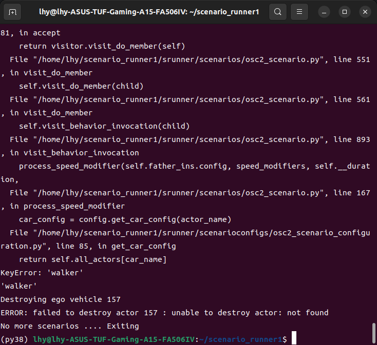

下周计划：

继续解决pedestrians在osc2中的编译问题。借助Carla提供的python API，连接Carla，使osc2描述的行人可以在设定的场景中展示，并表现出相关行为。


## 2024.9.9~2024.9.13

通过对osc_scenario_configuration.py、pedestrian.py的修改，行人模型以person在osc文件中表示，现已经可以通过编译。

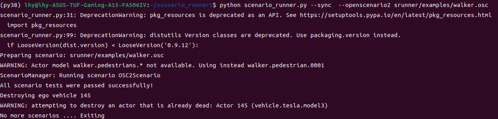

但又出现新的问题，无论选择哪种模型，程序始终默认设置pedestrian为0001号模型，应该是carla_data_provider.py中的request_new_actor函数中的model参数传输出现问题。

通过阅读代码得知，如果设置行人的速度，位置等信息，需要对osc2_scenario.py中的process_speed_modifier等函数进行改写，因为目前这些函数以车辆模型为主，相关属性的调用均是vehicle类中的属性。


下周计划：

解决行人模型选择的问题，可自由选择行人模型。对相关函数重写，使其适用于行人模型，可以借此设置行人的行为动作。


## 2024.9.16～2024.9.20

完成行人领域模型的完善，现已经可以在osc2文件中以peron:Walkerxx（xx表示选择的行人模型，支持01～48）来在场景中设置行人，并且可以通过speed、、position、lane等设置其行走的位置、速度等属性。


下周计划：

开始着手完善运动修饰符


## 2024.9.23～2024.9.27

将目前增加编写的代码全部上传至github。

浏览项目代码，确定目前关于运动修饰符号的实现涉及modifier.py、atomic_behaviors.py以及osc2_secnario.py文件。尝试在modifier.py中增加新的修饰符的定义。

|     修饰符号      | 是否实现 | 是否定义modifier类 | 为何种类型 |            定义            |
| :---------------: | :------: | :----------------: | :--------: | :------------------------: |
|       speed       |    是    |         是         |   speed    | 目前仅用于确定对象运动速度 |
|     position      |    是    |         是         |            |  确定对象在某个时间的位置  |
|       lane        |    是    |         是         |            | 根据别的对象，确定所在车道 |
|   acceleration    |    是    |         是         |   speed    |    确定加速度，进行加速    |
|     keep_lane     |    是    |                    |            |    让对象保持在当前车道    |
|   change_speed    |    是    |         是         |   speed    |     改变速度，可增可减     |
|    change_lane    |    是    |         是         |  location  |      向左向右改变车道      |
|   keep_position   |    是    |                    |            | 在规定时间内，保持位置不变 |
|    keep_speed     |    是    |                    |            | 在规定时间内，保持速度不变 |
|      lateral      |          |         是         |            | 根据别的对象，确定横向距离 |
|        yaw        |          |         是         |            |      运动角度左右偏向      |
|    orientation    |          |         是         |            | 确定yaw\pitch\roll三个偏角 |
|       alone       |          |         是         |            |     沿着某一条路径运动     |
| along_trajectory  |          |         是         |            |      沿设定的轨迹运动      |
|     distance      |          |         是         |            |      确定对象移动距离      |
| physical_movement |          |         是         |            |  确定对象是否具有物理属性  |
| avoid_collisions  |          |         是         |            |        是否允许碰撞        |


下周计划：

尝试完善keep_position、keep_speed、lateral，并设置相关场景动作。


## 2024.9.30~2024.10.11

对于不含参数的keep_position()和keep_speed()两个函数，均已经实现，并通过osc文件进行验证。但是对keep_position()的理解可能存在偏差。按照Openscenario2的解释，keep_position()函数是保证物体位置不变，但是实际场景生成中，好像用不到？存疑，后续深入场景构建时或许可以解答。


对于其他存在参数的运动修饰符，目前已经编写完其各自的modifier类，包括各自参数的处理。以便之后的在`osc2_scenario.py`中完成类的构建以及函数调用。


但实现函数仍存在困难。还需要了解这一模块的运行流程。


下周计划：

完成lateral、yaw、orientation，同时，确定运动修饰符号实现的必要性。


## 2024.10.14~2024.10.18

完成`osc2_scenario.py`中`visit_behavior_invocation`函数中，各个修饰符的参数处理部分。并根据这些参数处理，修改`modifier.py`中的修饰符类，确保可以正常接受`visit_behavior_invocation`函数中处理保存的参数。


关于修饰符实现的必要性，其中yaw和orientation重复性很高，代码编写同样具有重复性。alone和along_trajectory同样相似，但其实一个是设置地图中现有的固定道路，另一个是自己设定的轨迹，情况较为特殊。


下周计划：继续完善，从`atomic_behaviors.py`入手，编写以及调用修饰符涉及的基本运动元素。


## 头都大了 2024.10.22

目前来看，需要知道py_trees的使用。还需要再看一下当时的设计文档。总之挺难的，不仅仅从参数处理开始，还有一些基本的原子类行为来修改、编写。目前只完成了参数的处理，修饰符的定义。一想到后面的难度，哎哎哎，头大！


## 2024.10.20～2024.10.25

重新整理一下整个项目中OSC2部分的运行过程。目前正在处理的是行为树模块，项目采用py_trees的架构来构建行为树。运动修饰符作为改变物体运动状态的节点加入到行为树中，但不是直接加入，而是借助py_trees的框架来实现这一过程。

阅读`atomic_behaviors.py`代码，就能发现，该部分主要描述一些原子类行为（不可拆分的）。但实际上，每一个行为的编写均是按照py_trees提供的框架来编写。


完成了avoid_collisions运动修饰符的编写，基本原理就是利用`atomic_behaviors.py`中的WayPointFollower类，将其作为节点加入到行为树中。确定lateral修饰符与`atomic_behavior.py`中的`ActortransformSetter`类相关，接下来可以尝试完成。


但是，目前仍不清楚行为树是如何与Carla进行数据交换，从而实现场景的构造。以及不了解如何调用py_trees的API。


下周计划：学习py_trees，了解行为树的构造，以及与carla之间数据交换的原理。尝试构建新的行为树节点类型，以适应运动修饰符。


## 2024.10.28~2024.11.1

完成行为树的学习。

关于行为树和carla之间的数据交换：行为树只是起到一个引导场景中一系列行为的发生的作用，将每一个行为作为节点，依次执行，返回执行成功与否的结果。行为树本身是不具有控制Carla的作用。准确来说，是行为树中定义的每一个节点来实现了与Carla的数据交互。在`atomic_behavior.py`中，定义的每一个行为，通过调用Carla的API，以及获取Carla中模型的参数，并加以修改，来完成对场景的构建。


实现lateral：确定横向距离

3m：

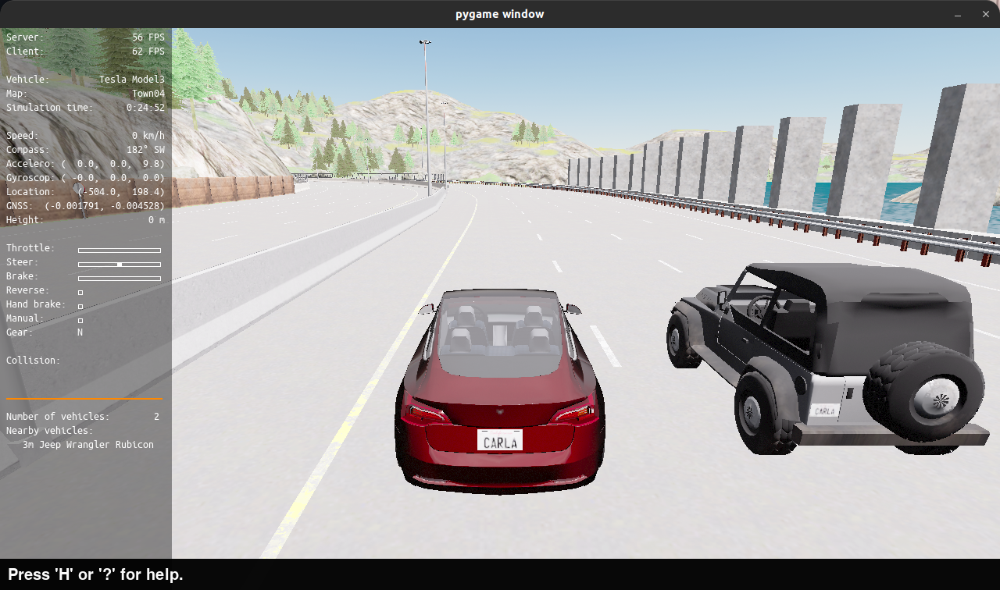

8m：

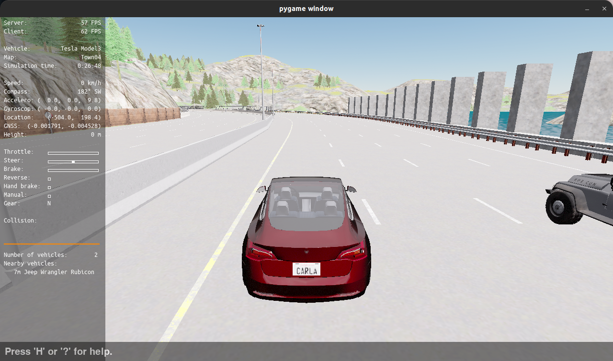

但是存在问题，具体的距离不能实际表现出来，而是通过车道来区分。例如2m和3m的表现是一样的，3m和8m的表现则是差了一个车道。

可能是waypoint设置的问题。


实现physical_movement()，能够定义物理模型是否符合物理规律。


接下来如果要实现yaw、orientation等之后的修饰符，可能需要自己再编写atomic_behavior。


下周计划，编写新的行为树节点类型，即定义新的行为。实现关于rotation的设置。


## 2024.11.04～2024.11.08

完成yaw、orientation和distance的编写。

实现的原理还是通过`atomic_behavior.py`中的类，通过Carla的API来修改场景中actor的参数。但yaw这类修改角度的操作并不能明显表示出来。可能actor模型的行为还是受限于waypoint。

另外对于一个车辆而言，可改变的角度只能是yaw角度，其他两个角度的修改没有什么意义。毕竟车辆在道路上行驶，属于是二维平面上的运动。


下周计划，完成最后两个修饰符，对`osc2scenarion.py`中的`process_speed_modifier`和`process_location_modifier`两个函数进行改写。


## 2024.11.11～2024.11.15

最后两个运动修饰符号先搁置一下。

完善了天气系统，目前可支持雨天、雾天、白天夜晚、刮风、多云，以及修改空气湿度。

基本原始场景：

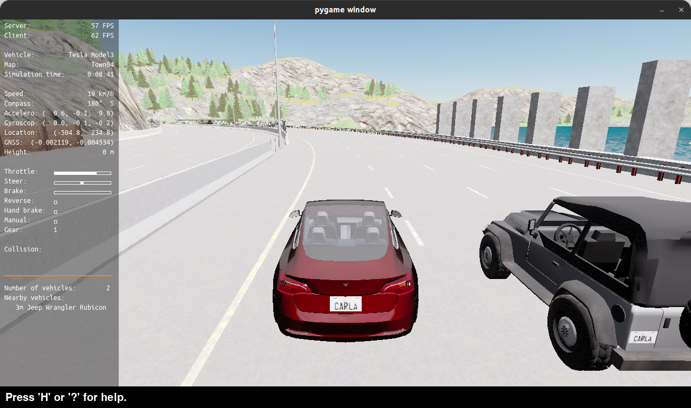

雨天（不是很明显）：

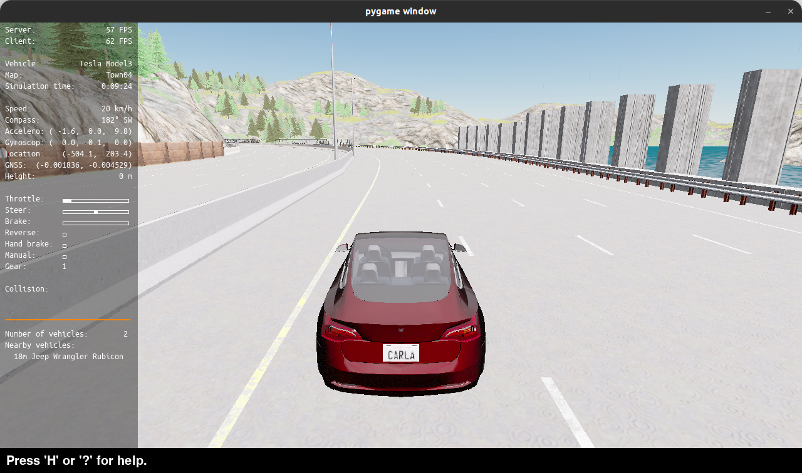

雾天（没有具体的雾气，可能是参数设置的问题）：

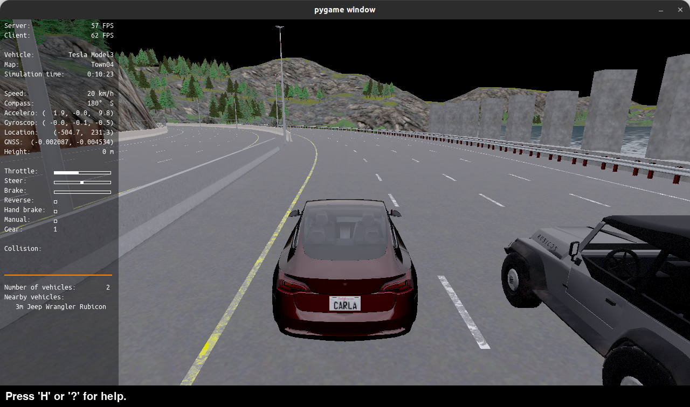

刮风（不是很明显）：

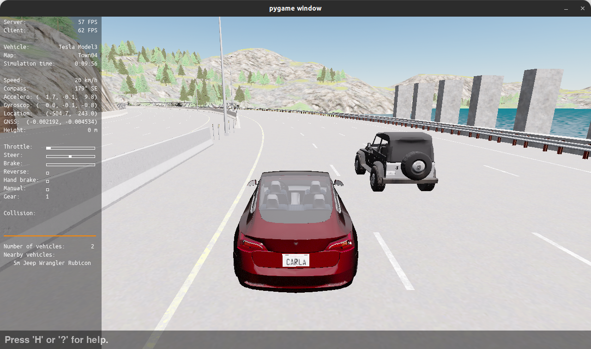

多云：

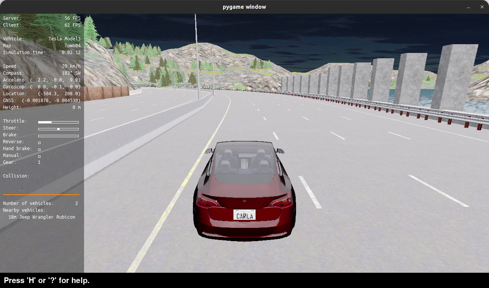

黑夜：

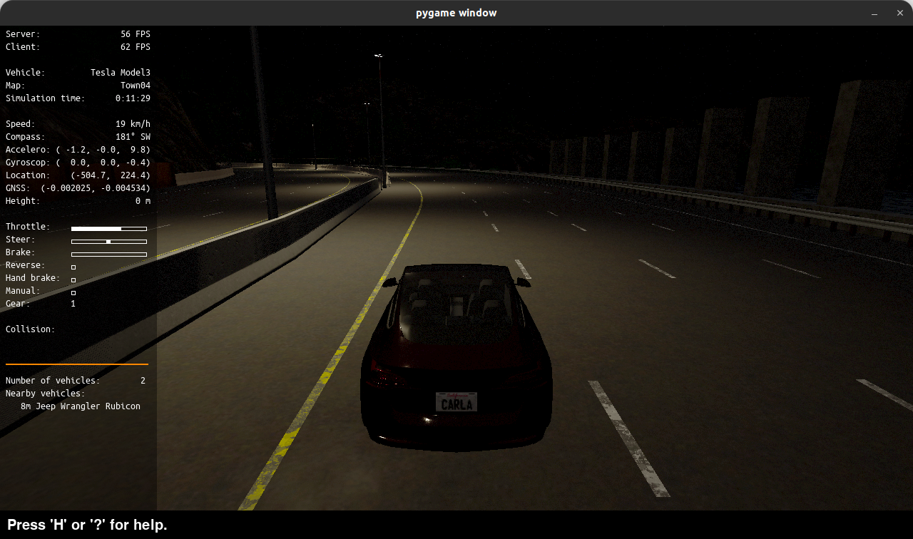

空气湿度提高：

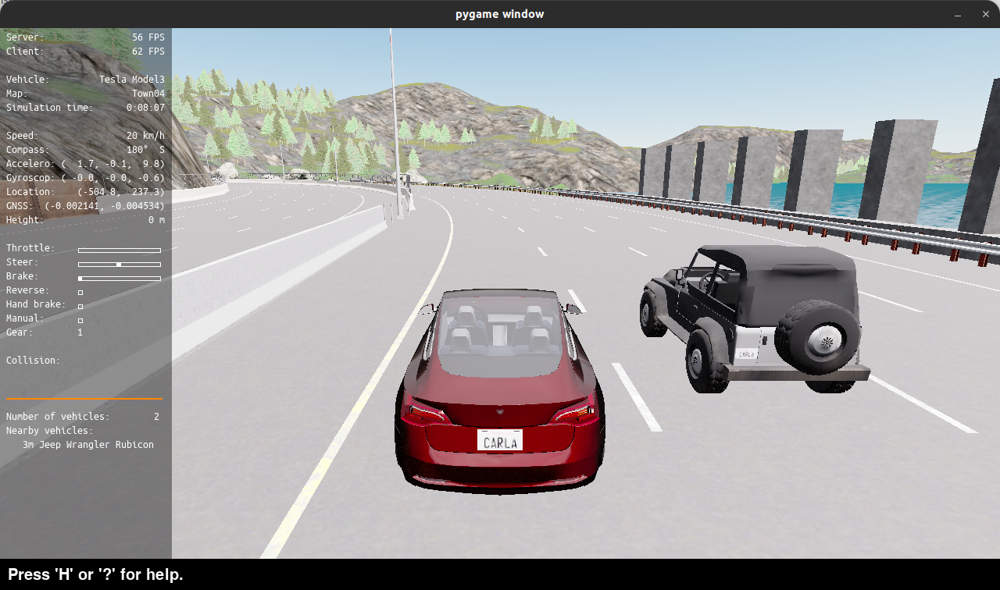

基本的函数已编写实现，但是在参数这里，目前只接受float类型，并没有按照需求以phycial类型输入，这是需要修改完善的地方。


下周计划：对项目进行测试并完善，解决目前遗留的问题，例如phycial类型参数的处理。


## 2024.11.18～2024.11.22

解决Phycial类型参数的问题，对运动修饰符和天气修饰符的使用均可以Phycial的方式输入，例如：

```
#之前
fog(100)
rain(20)

#现在
fog(100m) #表示雾天的可视距离
rain(20mmph) #表示降雨量
```

对项目进行测试，确定当前进度以及之后安排。


下周计划，解决action类的问题，包含drive和walk之类函数的混淆问题。
