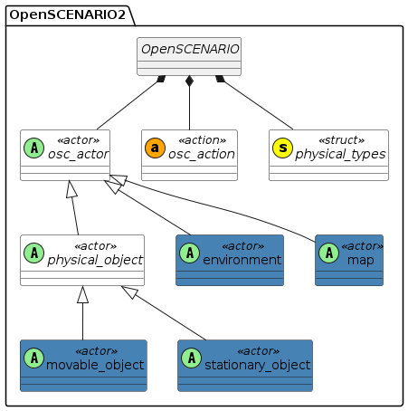
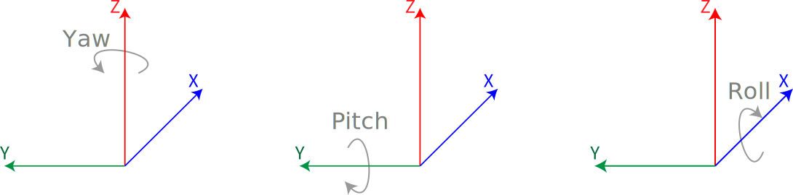
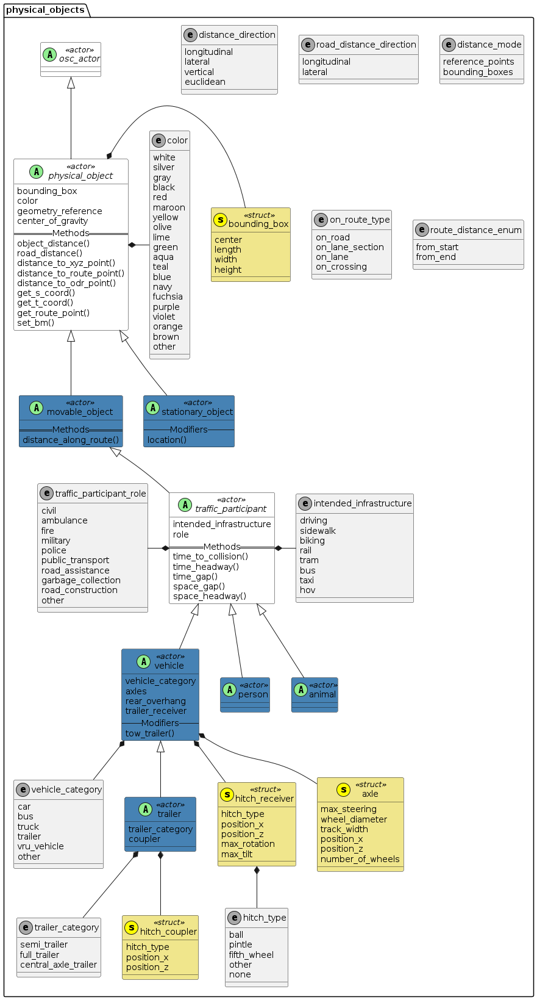
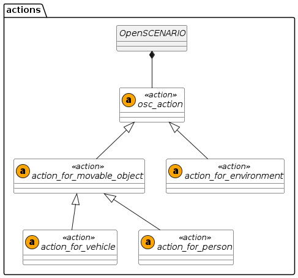
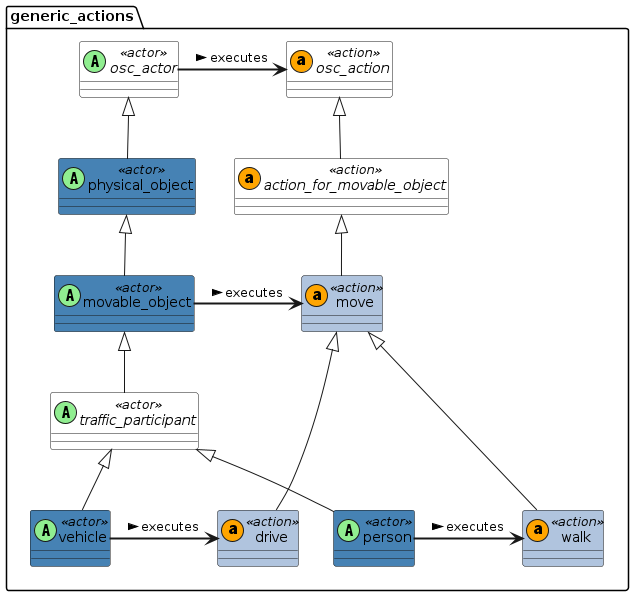
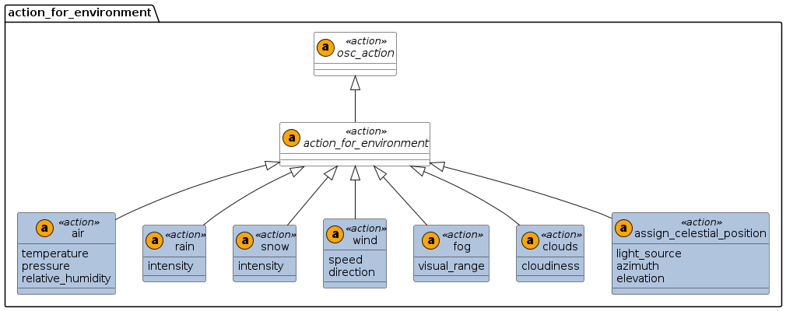

# 关于OpenScenario2

### 前言

依旧是怕忘记了，另外一方面，记录一下某些地方的必要性。就是说某些语句是否有实现的必要。


## 基本定义

### 格式及注释

python类型


### 关键字

|                |           |            |        |          |
| -------------- | --------- | ---------- | ------ | -------- |
| action         | actor     | and        | as     | bool     |
| call           | cd        | cover      | def    | default  |
| do             | elapsed   | emit       | enum   | event    |
| every          | export    | expression | extend | external |
| factor         | fall      | false      | float  | global   |
| hard           | if        | import     | in     | inf      |
| inherits       | int       | is         | it     | K        |
| keep           | kg        | list       | m      | modifier |
| mol            | namespace | nan        | not    | null     |
| of             | offset    | on         | one_of | only     |
| or             | parallel  | rad        | range  | record   |
| remove_default | rise      | s          | sample | scenario |
| serial         | SI        | string     | struct | true     |
| type           | uint      | undefined  | unit   | until    |
| use            | var       | wait       | with   |          |


### 新的变量类型

物理变量：数值+单位

```
physical-literal ::= (float-literal | integer-literal) unit-name
unit-name ::= qualified-identifier
```


Range类型：

定义：

```
range-constructor ::= 'range' '(' expression ',' expression ')' | '[' expression '..' expression ']'
```

实例：

```
scenario bar:
    aspeed: speed
    afloat: float
    gear: uint
    keep(afloat in [10..20])
    keep(gear in [-1..6])

scenario foo:
    car: vehicle
    do parallel(duration: [10s..20s]):
        car.drive() with:
            speed([80kph..120kph])
        bar(aspeed: [20kph..40kph])
```


### 命名空间

​        闲得没事搞这玩意


### 单位

在原理已经被收为关键字的单位中，还可以进行拓展，定义新的物理单位。准确来说，涉及的单位都是SI基本单位。

```
unit km of length is SI(m: 1, factor: 1000.0)
```

公式：

```
base_unit_value = unit_value * factor + offset
```


### 结构化

struct定义

```
struct traffic_light:
    id: int
    name: string
    pose: pose_3d
    active_colors: list of traffic_light_colors
    country: string
```


actor定义：

```
actor rock:
    kind: string
    weight: mass
    extent: length
    position: position_3d
```


scenario定义：

```
scenario pass_ego:
    ego: vehicle
    passing_car: vehicle

    do parallel:
        ego.drive() with:
            speed(50kph)

        passing_car.drive() with:
            lane(left_of: ego)
            speed(70kph)
```


### 方法

语法：

```
def <method-name>(<argument-list-specification>) [-> <return-type>] <method-implementation>
```

实例：

```
def my_add(x: float, y: float) -> float is expression x+y
```


### 继承

一个场景描述语言，要什么继承？

无条件继承：

```
struct base:
    f1: bool

struct derived inherits base:
    f2: bool          #derived has both f1 and f2 fields
```

有条件继承：

```
extend vehicle:
    is_electric: bool

actor truck inherits vehicle (vehicle_category == truck):
    ...                    # Fields / methods / events unique to truck

actor electric_vehicle inherits vehicle(is_electric == true):
    ...                    # Fields / methods /events unique to electric_vehicle
```


### 事件

定义事件，并且借助`on`、`wait`、`until`等来确定事情发生的条件

```
event <name> [(<argument-list-specification>)] [is <event-specification>]
```

例如

```
on @x.accident:                # When the event happens, do something
     call dut_error(...)
wait distance_to(car2) < 10m   # Wait until the expression is true
event e1 is @e2 if (x > y)     # Emits e1 when e2 happens and the Boolean expression returns true
```


### 覆盖

虽然但是，我还是想吐槽一句，这有必要吗？


## 领域模型

### 实体关系



### 坐标系



### 地图

暂定，涉及到地图导入


### 整体物理模型



### Ation

使用方法均是xxx.action(xxx)

可移动物体：

|       Action        |                 定义                 |                             用法                             |
| :-----------------: | :----------------------------------: | :----------------------------------------------------------: |
|        move         |           可移动物体的移动           |    movable_object.move([, <inherited action parameters>])    |
|   assign_position   |            移动到指定位置            | movable_object.assign_position(position: position_3d [, <inherited action parameters>])<br/><br/>movable_object.assign_position(route_point: route_point [, <inherited action parameters>])<br/><br/>movable_object.assign_position(odr_point: odr_point [, <inherited action parameters>]) |
| assign_orientation  |            移动到指定方向            | movable_object.assign_orientation(orientation: orientation_3d [, <inherited action parameters>]) |
|    assign_speed     |             达到指定速度             | movable_object.assign_speed(speed: speed [, <inherited action parameters>]) |
| assign_acceleration |            达到指定加速度            | movable_object.assign_acceleration(acceleration: acceleration[, <inherited action parameters>]) |
|     replay_path     |              沿着路径走              | movable_object.replay_path(absolute: path<br/>[, start_offset: length] [, end_offset: length] [, <inherited action parameters>])<br/><br/>movable_object.replay_path(relative: relative_path, reference: physical_object, transform: relative_transform,<br/>[, start_offset: length] [, end_offset: length] [, <inherited action parameters>]) |
|  replay_trajectory  |            沿着指定轨迹走            | movable_object.replay_trajectory(absolute: trajectory<br/>[, start_offset: length] [, end_offset: length] [, <inherited action parameters>])<br/><br/>movable_object.replay_trajectory(relative: relative_trajectory, reference: physical_object, transform: relative_transform,<br/>[, start_offset: length] [, end_offset: length] [, <inherited action parameters>]) |
|  remain_stationary  |               保持静止               | movable_object.remain_stationary([, <inherited action parameters>]) |
|   change_position   | 创建从角色的当前位置到目标位置的路径 | movable_object.change_position(target_xyz: position_3d, interpolation: path_interpolation, on_road_network: bool<br/>[, <inherited action parameters>])<br/><br/>movable_object.change_position(target_st: route_point, interpolation: path_interpolation, on_road_network: bool<br/>[, <inherited action parameters>])<br/><br/>movable_object.change_position(target_odr: odr_point, interpolation: path_interpolation, on_road_network: bool<br/>[, <inherited action parameters>]) |
|    change_speed     |              修改其速度              | movable_object.change_speed(target: speed<br/>[, rate_profile: dynamic_profile [, rate_peak: acceleration]] [, <inherited action parameters>]) |
|     keep_speed      |              保持其速度              | movable_object.keep_speed([, <inherited action parameters>]) |
| change_acceleration |             修改其加速度             | movable_object.change_acceleration(target: acceleration<br/>[, rate_profile: dynamic_profile [, rate_peak: jerk]] [, <inherited action parameters>]) |
|  keep_acceleration  |             保持其加速度             | movable_object.keep_acceleration([, <inherited action parameters>]) |
|     follow_path     |          紧密地跟随目标路径          | movable_object.follow_path(absolute: path<br/>[, start_offset: length] [, end_offset: length] [, <inherited action parameters>])<br/><br/>movable_object.follow_path(relative: relative_path, reference: physical_object, transform: relative_transform,<br/>[, start_offset: length] [, end_offset: length] [, <inherited action parameters>]) |
|  follow_trajectory  |          紧密地跟随目标轨迹          | movable_object.follow_trajectory(absolute: trajectory<br/>[, start_offset: length] [, end_offset: length] [, <inherited action parameters>])<br/><br/>movable_object.follow_trajectory(relative: relative_trajectory, reference: physical_object, transform: relative_transform,<br/>[, start_offset: length] [, end_offset: length] [, <inherited action parameters>]) |


车辆：

|        Action        |                 定义                 |                             用法                             |
| :------------------: | :----------------------------------: | :----------------------------------------------------------: |
|        drive         |               启动车辆               |       vehicle.drive([, <inherited action parameters>])       |
|     follow_lane      |         保持在 lane 的边界内         | vehicle.follow_lane([<inherited action parameters>])<br/><br/>vehicle.follow_lane(offset: length<br/>[, rate_profile: dynamic_profile [, rate_peak: speed]] [, <inherited action parameters>])<br/><br/>vehicle.follow_lane(target: lane<br/>[, offset: length] [, rate_profile: dynamic_profile] [, rate_peak: speed] [, <inherited action parameters>]) |
|     change_lane      |       动作结束时移动到目标车道       | vehicle.change_lane(num_of_lanes: uint, side: lane_change_side, reference: physical_object,<br/>[, offset: length] [, rate_profile: dynamic_profile [, rate_peak: speed]] [, <inherited action parameters>])<br/><br/>vehicle.change_lane(target: lane<br/>[, offset: length] [, rate_profile: dynamic_profile [, rate_peak: speed]] [, <inherited action parameters>]) |
|   change_time_gap    |     将其与引用实体的时间间隔更改     | vehicle.change_time_gap(target: time, direction: gap_direction, reference: physical_object, [, <inherited action parameters>]) |
|    keep_time_gap     |        与参考实体保持时间间隔        | vehicle.keep_time_gap(reference: physical_object, direction: road_distance_direction [, <inherited action parameters>]) |
|   change_space_gap   |        将其间距更改为引用实体        | vehicle.change_space_gap(target: length, direction: gap_direction, reference: physical_object, [, <inherited action parameters>]) |
|    keep_space_gap    |          与参考实体保持间距          | vehicle.keep_space_gap(reference: physical_object, direction: road_distance_direction [, <inherited action parameters>]) |
| change_time_headway  |      更改其到引用实体的时间间隔      | vehicle.change_time_headway(target: time, direction: headway_direction, reference: physical_object [, <inherited action parameters>]) |
|  keep_time_headway   |       保持到引用实体的时间间隔       | vehicle.keep_time_headway(reference: physical_object [, <inherited action parameters>]) |
| change_space_headway |            更改为引用实体            | vehicle.change_space_headway(target: length, direction: headway_direction, reference: physical_object [, <inherited action parameters>]) |
|  keep_space_headway  |        与引用实体保持一个间隔        | vehicle.keep_space_headway(reference: physical_object [, <inherited action parameters>]) |
|   connect_trailer    | 将拖车的耦合器连接到牵引车上的接收器 |                             xxx                              |
|  disconnect_trailer  | 断开拖车的耦合器与牵引车接收器的连接 |                             xxx                              |


行人：

| Action |   定义   |                      用法                      |
| :----: | :------: | :--------------------------------------------: |
|  walk  | 行人行走 | person.walk([, <inherited action parameters>]) |


### 动作行为






### 运动修饰符的通用参数

- at

  all：在此阶段保持不变

  start：在开始阶段成立

  end：在结束阶段成立

- movement_mode

  monotonous：遵循物理规律

  other：跟踪参考车辆的“预计”运动

- track

  actual：跟踪参考车辆的实际移动。这是默认设置。

  projected：跟踪参考车辆的“预计”运动

- shape

  貌似没啥用


### 环境模型


### 环境行为



##### 使用示例：

空气：

```
# All three variables
environment.air(15.0celsius, 1050.0hPa, 0.65)
environment.air(temperature: 15.0celsius, pressure: 1050.0hPa, relative_humidity: 0.65)

# Only temperature and relative humidity (presure is not modified)
environment.air(15.0celsius, relative_humidity: 0.65)
environment.air(temperature: 15.0celsius, relative_humidity: 0.65)

# Only temperature
environment.air(15.0celsius)
environment.air(temperature: 15.0celsius)

# Only pressure
environment.air(pressure: 1050.0hPa)

# Only relative_humidity
environment.air(relative_humidity: 0.65)
```


下雨：

```
environment.rain(20.0mmph)
environment.rain(intensity: 20.0mmph)
```


下雪：

```
environment.snow(10.0mmph)
environment.snow(intensity: 10.0mmph)
```


风：

```
# Both variables
environment.wind(3.0mps, 45deg)
environment.wind(speed: 3.0mps, direction: 45deg)

# Only wind speed
environment.wind(3.0mps)
environment.wind(speed: 3.0mps)

# Only wind direction
environment.wind(direction: 45deg)
```


雾：

```
environment.fog(0.2km)
environment.fog(visual_range: 0.2km)
```


云：

```
environment.clouds(4)
environment.clouds(cloudiness: 4)
```


太阳月亮：

```
# For moon position
environment.assign_celestial_position(environment.moon, 270deg, 90deg)
environment.assign_celestial_position(environment.moon, azimuth: 270deg, elevation: 90deg)

# For sun position
environment.assign_celestial_position(environment.sun, 100deg, 40deg)
environment.assign_celestial_position(environment.sun, azimuth: 100deg, elevation: 40deg)

# For sun, assign only azimuth
environment.assign_celestial_position(environment.sun, azimuth: 100deg)

# For sun, assign only elevation
environment.assign_celestial_position(environment.sun, elevation: 40deg)
```


### 红绿灯

暂时搁置


### 规定好的单位

建议使用type.osc，一劳永逸。


### 代码规范

- 缩进是四个空格字符
- UTF-8编码
- 逗号后面空一格
- 冒号后面空一格
- 关键字前后各空一格
- 运算符前后各空一格
- #用于注释
- \用于换行
- 命名采用下划线式


### 拓展

还是省省吧。先把前面搞定了再说。
