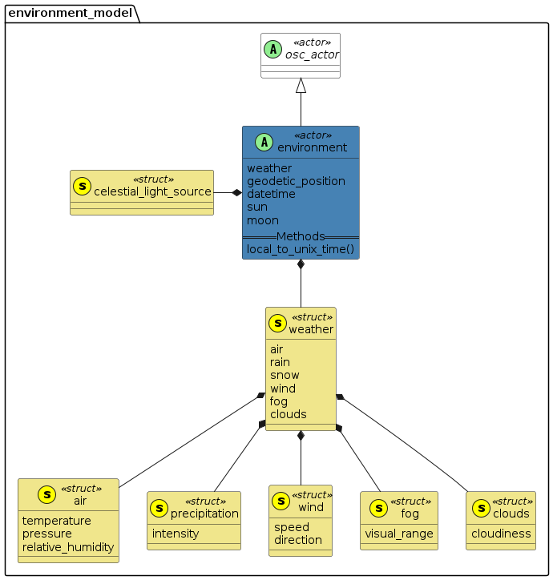

# 关于OpenScenario2

### 前言

依旧是怕忘记了，另外一方面，记录一下某些地方的必要性。就是说某些语句是否有实现的必要。


## 基本定义

### 格式及注释

python类型


### 关键字

|                |           |            |        |          |
| -------------- | --------- | ---------- | ------ | -------- |
| action         | actor     | and        | as     | bool     |
| call           | cd        | cover      | def    | default  |
| do             | elapsed   | emit       | enum   | event    |
| every          | export    | expression | extend | external |
| factor         | fall      | false      | float  | global   |
| hard           | if        | import     | in     | inf      |
| inherits       | int       | is         | it     | K        |
| keep           | kg        | list       | m      | modifier |
| mol            | namespace | nan        | not    | null     |
| of             | offset    | on         | one_of | only     |
| or             | parallel  | rad        | range  | record   |
| remove_default | rise      | s          | sample | scenario |
| serial         | SI        | string     | struct | true     |
| type           | uint      | undefined  | unit   | until    |
| use            | var       | wait       | with   |          |


### 新的变量类型

物理变量：数值+单位

```
physical-literal ::= (float-literal | integer-literal) unit-name
unit-name ::= qualified-identifier
```


Range类型：

定义：

```
range-constructor ::= 'range' '(' expression ',' expression ')' | '[' expression '..' expression ']'
```

实例：

```
scenario bar:
    aspeed: speed
    afloat: float
    gear: uint
    keep(afloat in [10..20])
    keep(gear in [-1..6])

scenario foo:
    car: vehicle
    do parallel(duration: [10s..20s]):
        car.drive() with:
            speed([80kph..120kph])
        bar(aspeed: [20kph..40kph])
```


### 命名空间

闲得没事搞这玩意


### 单位

在原理已经被收为关键字的单位中，还可以进行拓展，定义新的物理单位。准确来说，涉及的单位都是SI基本单位。

```
unit km of length is SI(m: 1, factor: 1000.0)
```

公式：

```
base_unit_value = unit_value * factor + offset
```


### 结构化

struct定义

```
struct traffic_light:
    id: int
    name: string
    pose: pose_3d
    active_colors: list of traffic_light_colors
    country: string
```


actor定义：

```
actor rock:
    kind: string
    weight: mass
    extent: length
    position: position_3d
```


scenario定义：

```
scenario pass_ego:
    ego: vehicle
    passing_car: vehicle

    do parallel:
        ego.drive() with:
            speed(50kph)

        passing_car.drive() with:
            lane(left_of: ego)
            speed(70kph)
```


### 方法

语法：

```
def <method-name>(<argument-list-specification>) [-> <return-type>] <method-implementation>
```

实例：

```
def my_add(x: float, y: float) -> float is expression x+y
```


### 继承

一个场景描述语言，要什么继承？

无条件继承：

```
struct base:
    f1: bool

struct derived inherits base:
    f2: bool          #derived has both f1 and f2 fields
```

有条件继承：

```
extend vehicle:
    is_electric: bool

actor truck inherits vehicle (vehicle_category == truck):
    ...                    # Fields / methods / events unique to truck

actor electric_vehicle inherits vehicle(is_electric == true):
    ...                    # Fields / methods /events unique to electric_vehicle
```


### 事件

定义事件，并且借助`on`、`wait`、`until`等来确定事情发生的条件

```
event <name> [(<argument-list-specification>)] [is <event-specification>]
```

例如

```
on @x.accident:                # When the event happens, do something
     call dut_error(...)
wait distance_to(car2) < 10m   # Wait until the expression is true
event e1 is @e2 if (x > y)     # Emits e1 when e2 happens and the Boolean expression returns true
```


### 覆盖

虽然但是，我还是想吐槽一句，这有必要吗？


## 领域模型

### 实体关系


### 坐标系


### 地图

暂定，涉及到地图导入


### 整体物理模型


### 动作行为


### 运动修饰符的通用参数

- at

  all：在此阶段保持不变

  start：在开始阶段成立

  end：在结束阶段成立

- movement_mode

  monotonous：遵循物理规律

  other：跟踪参考车辆的“预计”运动

- track

  actual：跟踪参考车辆的实际移动。这是默认设置。

  projected：跟踪参考车辆的“预计”运动

- shape

  貌似没啥用


### 环境模型




### 环境行为


##### 使用示例：

空气：

```
# All three variables
environment.air(15.0celsius, 1050.0hPa, 0.65)
environment.air(temperature: 15.0celsius, pressure: 1050.0hPa, relative_humidity: 0.65)

# Only temperature and relative humidity (presure is not modified)
environment.air(15.0celsius, relative_humidity: 0.65)
environment.air(temperature: 15.0celsius, relative_humidity: 0.65)

# Only temperature
environment.air(15.0celsius)
environment.air(temperature: 15.0celsius)

# Only pressure
environment.air(pressure: 1050.0hPa)

# Only relative_humidity
environment.air(relative_humidity: 0.65)
```


下雨：

```
environment.rain(20.0mmph)
environment.rain(intensity: 20.0mmph)
```


下雪：

```
environment.snow(10.0mmph)
environment.snow(intensity: 10.0mmph)
```


风：

```
# Both variables
environment.wind(3.0mps, 45deg)
environment.wind(speed: 3.0mps, direction: 45deg)

# Only wind speed
environment.wind(3.0mps)
environment.wind(speed: 3.0mps)

# Only wind direction
environment.wind(direction: 45deg)
```


雾：

```
environment.fog(0.2km)
environment.fog(visual_range: 0.2km)
```


云：

```
environment.clouds(4)
environment.clouds(cloudiness: 4)
```


太阳月亮：

```
# For moon position
environment.assign_celestial_position(environment.moon, 270deg, 90deg)
environment.assign_celestial_position(environment.moon, azimuth: 270deg, elevation: 90deg)

# For sun position
environment.assign_celestial_position(environment.sun, 100deg, 40deg)
environment.assign_celestial_position(environment.sun, azimuth: 100deg, elevation: 40deg)

# For sun, assign only azimuth
environment.assign_celestial_position(environment.sun, azimuth: 100deg)

# For sun, assign only elevation
environment.assign_celestial_position(environment.sun, elevation: 40deg)
```


### 红绿灯

暂时搁置


### 规定好的单位

建议使用type.osc，一劳永逸。


### 代码规范

- 缩进是四个空格字符
- UTF-8编码
- 逗号后面空一格
- 冒号后面空一格
- 关键字前后各空一格
- 运算符前后各空一格
- #用于注释
- \用于换行
- 命名采用下划线式


### 拓展

还是省省吧。先把前面搞定了再说。
