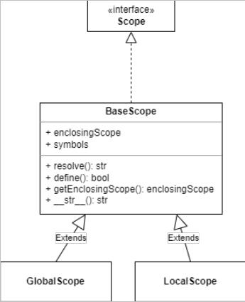
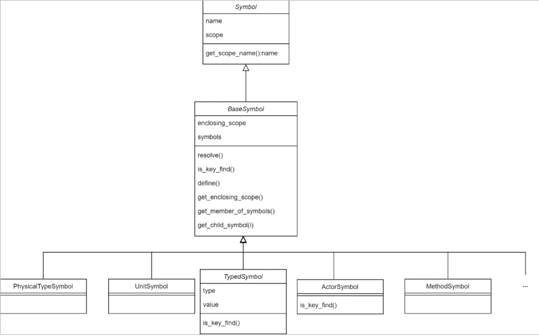

## 此文档记录我对该项目运行过程的理解，也是防止我忘性大，后期维护不知如何下手。

### 项目的整体运行

​	不理清一下，真让人头大。数不清的类，数不清的继承，数不清的调用。哎哎哎……

​	首先我们只针对支持Openscenario2的部分，从`scenario_runner.py`开始，从主函数main开始，根据输入命令，先一步处理参数，其中最重要的就是osc文件的位置。然后，就是一切的开端。先获取`scenario_runner = ScenarioRunner(arguments)`，之后再运行场景`result=scenario_runner.run()`。

​	分为两步来说。先说获取阶段：初始化ScenarioRunner类，其中init时构造Scenariomanager类，可以理解为对生成的场景的管理。

​	第二步，run()，这里在、run的函数就可以看到，需要选择run_osc2()。转到run_osc2的函数后，正式进入osc2的模块。先初始化`config=OSC2SecenarioConfiguration`类，之后运行`_load_and_run_scenario(config)`。

#### config初始化

​	初始化config就涉及到`osc2_scenario_configuration.py`，这里初始化的时候就运行这一函数`self._parse_osc2_configuration()`，以及之后还初始化 了ConfigInit类。先看`self._parse_osc2_configuration()`，直接写明是解释osc2文件。既然都这么说了，那就结下往下看。

​	因为ConfigInit继承了ASTVisitor，那么开始遍历抽象语法树吧。

> [!CAUTION]
>
> 重要部分


#### 运行self._load_and_run_scenario(config)

​	运行这部分又涉及到OSC2Scenario类，初始化`scenario = OSC2Scenario()`,转入`osc2_scenario.py`。初始化OSC2Scenario类后，又初始化其基类.

> [!CAUTION]
>
> 重要部分

​	OSC2Scenario这个类写明了是实现osc2场景，由BasicScenario继承而来。初始化OSC2Scenario类后，又初始化其基类。在其基类BasicScenario中，运行`behavior = self._create_behavior()`，实际上是调用子类的方法，位于`osc2_scenario.py`中。包括之后的`criteria = self._create_test_criteria()`也是。再回头看看`osc2_scenario.py`,`behavior = self._create_behavior()`运行时，初始化了`behavior_builder = self.BehaviorInit(self)`，然后又开始遍历了。最后`behavior`被加入到行为树`behavior_seq`中。


另外一点就是，当初始化OSC2ScenarioConfiguration类的时候，`self.ast_tree = OSC2Helper.gen_osc2_ast(self.filename)`说明了已经构建了ast树。

包括之后的OSC2Scenario也是，`self.ast_tree = OSC2Helper.gen_osc2_ast(self.osc2_file)`也构建了ast树。


#### 关于 visit那些事情

​	上文两次提到遍历的事情，一次是解析osc2文件时的`conf_visitor.visit(self.ast_tree)`，另一次是运动行为的遍历`behavior_builder.visit(self.ast_tree)`，参数都是`self.ast_tree`。分别是`self.ast_tree = OSC2Helper.gen_osc2_ast(self.filename)`和`self.ast_tree = OSC2Helper.gen_osc2_ast(self.osc2_file)`。

​	无论是Behaviornit还是Confinit，都是继承自ASTVisitor。

​	先看`ast_visitor.py`吧，BaseVisitor为基类，ASTVisitor为子类。其实仔细看，ASTVisitor类里面都是一个基本的函数，大多数都是被BehaviorInit和Confnit进行覆写。从Basevisitor开始，万恶之源`visit`函数，`tree.accept()`实际上已经和`ast_node.py`绑定在一起了。这里的`tree.accept(self)`，本质上是看`ast_node.py`里面各类节点相对应的节点。而accept里面则是visitor的各类操作。

​	


​	接下来，轮到已构造的Scenariomanager类登场，进行场景载入和场景运行。场景载入部分`load_scenario()`，好像没什么说的。场景运行部分`run_scenario`，貌似也没啥说的。


#### 后面就是撤销场景了，暂时不管

​	待定……


### OSC2Helper的解释

`osc2_helper.py`是用来提供一些便捷函数的，无需初始化类，拿来就能用。

例如最常见的`flat_list`函数，就是将嵌套的列表转为一位的列表，多用于参数处理的时候。


#### gen_osc2_ast

最为重要的就是`gen_osc2_ast`函数，osc2文件名作为参数输入，经过antlr4解析，构建抽象语法树。

借助了antlr4的能力，构建出抽象语法树AST，并将根节点返回。


### 车辆模型全部支持部分

​	这部分没什么难度，主要就是针对于`vehicle.py`进行修改，其实观察之前的车辆模型的定义就可知。先定义最初的基类，再在基类的基础上设置各个车辆类型的定义。项目目前对车辆的定义也仅仅停留在设置`model`参数上，根据carla官方文档提供的各类已存在车辆模型的`model`来进行补充。最后对`osc2_congifuration.py`中的vehicle_type进行补充，就OK了。

### 行人领域模型完善部分

​	代码量实际并不大，但是弄懂确实花费了不少功夫。就目前我所知，通过osc2语言来在场景中构建物理模型，本质上还是通过Carla的API调用。Carla的官方文档中写明，blueprint提供了目前carla已支持的模型。其中就有行人模型，从01~48号人物模型。那么，对于`pedestrians.py`的编写，借鉴`vehicle.py`不失为一个好主意。同样设置一个基类，再通过继承，再编写每个行人模型不同model参数。这里不难。

​	坑人的是接下来，如何让这个”编译器“能够识别定义行人的osc2语言，然后在场景中构建出来呢？先在`osc2_scenairo_configuration.py`中把pedestrians_type写一下吧……the replay by 1 second (+SHIFT = 10 seconds)

​	主要还是在`osc2_scenario_configuration.py`里面编写，老样子，照葫芦画瓢，参考对车辆模型的处理。在函数中写个基本的函数来处理。

​	其实在看了`carla_data_provide.py`，发现这里已经处理了osc2中对物理模型的语言的编译。所以实际上我需要做的也只有定义行人模型，再加上一些对行人特定的函数来处理罢了。

​	这样来看似乎也挺容易，但真去编写的时候，头都大了。 


### 关于行为树——py_trees

​	难搞，我以为只是生成普通的二叉树。哪知道这玩意是行为树，大多用于构建游戏中AI的行动。用在场景生成，好像也没毛病。所以，在此开个新坑，学习行为树。哎哎哎，又让人头大。

##### `Behaviours`：

基本框架：

```python
#!/usr/bin/env python3

# -*- coding: utf-8 -*-


import py_trees

import random


class Foo(py_trees.behaviour.Behaviour):

    def __init__(self, name):

        """

        Minimal one-time initialisation. A good rule of thumb is

        to only include the initialisation relevant for being able

        to insert this behaviour in a tree for offline rendering to

        dot graphs.


        Other one-time initialisation requirements should be met via

        the setup() method.

        """

        super(Foo, self).__init__(name)


    def setup(self):

        """

        When is this called?

          This function should be either manually called by your program

          to setup this behaviour alone, or more commonly, via

          :meth:`~py_trees.behaviour.Behaviour.setup_with_descendants`

          or :meth:`~py_trees.trees.BehaviourTree.setup`, both of which

          will iterate over this behaviour, it's children (it's children's

          children ...) calling :meth:`~py_trees.behaviour.Behaviour.setup`

          on each in turn.


          If you have vital initialisation necessary to the success

          execution of your behaviour, put a guard in your

          :meth:`~py_trees.behaviour.Behaviour.initialise` method

          to protect against entry without having been setup.


        What to do here?

          Delayed one-time initialisation that would otherwise interfere

          with offline rendering of this behaviour in a tree to dot graph

          or validation of the behaviour's configuration.


          Good examples include:


          - Hardware or driver initialisation

          - Middleware initialisation (e.g.
            print(f"The car changes lanes to the {av_side} for {lane_changes} lanes.")
            npc_name = modifier.get_acto ROS pubs/subs/services)

          - A parallel checking for a valid policy configuration after

            children have been added or removed

        """

        self.logger.debug("  %s [Foo::setup()]" % self.name)


    def initialise(self):

        """

        When is this called?

          The first time your behaviour is ticked and anytime the

          status is not RUNNING thereafter.


        What to do here?

          Any initialisation you need before putting your behaviour

          to work.

        """

        self.logger.debug("  %s [Foo::initialise()]" % self.name)


    def update(self):

        """

        When is this called?

          Every time your behaviour is ticked.


        What to do here?

          - Triggering, checking, monitorin
            print(f"The car changes lanes to the {av_side} for {lane_changes} lanes.")
            npc_name = modifier.get_actog. Anything...but do not block!

          - Set a feedback message

          - return a py_trees.common.Status.[RUNNING, SUCCESS, FAILURE]

        """

        self.logger.debug("  %s 
        [Foo::update()]" % self.name)

        ready_to_make_a_decision = random.choice([True, False])

        decision = random.choice([True, False])

        if not ready_to_make_a_decision:

            return py_trees.common.Status.RUNNING

        elif decision:

            self.feedback_message = "We are not bar!"

            return py_trees.common.Status.SUCCESS

        else:

            self.feedback_message = "Uh oh"

            return py_trees.common.Status.FAILURE


    def terminate(self, new_status):

        """

        When is this called?

           Whenever your behaviour switches to a non-running state.

            - SUCCESS || FAILURE : your behaviour's work cycle has finished

            - INVALID : a higher priority branch has interrupted, or shutting down

        """

        self.logger.debug("  %s [Foo::termi
            print(f"The car changes lanes to the {av_side} for {lane_changes} lanes.")
            npc_name = modifier.get_actonate().terminate()][%s->%s]" % (self.name, self.status, new_status))
```

在基本框架中，`update()`方法中需要确定行为的状态。状态用于影响行为树之后的运行方向。py_trees.common.Status(value)用于确定状态。

分为FAILURE：操作失败；INVALID：未初始化/处于非活动状态；RUNNING：正在执行；SUCCESS：操作完成，结果成功。


##### `Composites`：

包含了Sequence、Parallel和Selector。行为树就是这样，通过这几个元素来进行组合创作。

###### Selector：

根据级联优先级执行子项。 `py_trees.composites.Selector(name,memory,children)`，selector一次执行它的每一个子行为，指导其中一个成功，或者全部失败。

name：复合行为的名称。memory：如果上一个节点在running，使用该节点进行恢复。children：要添加的子行为列表。

###### Sequence：

顺序执行子行为，如果某个子行为FAILURE或者RUNNING，则序列停止，父项采用此结果。如果到达最后一个子项，无论如何都输出这个结果。`py_trees.composites.Sequence(name,memory,children)`，参数解释同上。

###### Parallel：

没有策略时，所有子行为都返回SUCCESS时，才返回SUCCESS。有策略时，只有指定子行为在返回SUCCESS时才能返回SUCCESS。

`py_trees.composites.Parallel(name,policy,children)`


##### `Decorators`:

扣帽子的过程？


##### `Blackboards`：

行为树中的行为共享数据的地方

存在自定义行为：

```python
class Foo(py_trees.behaviour.Behaviour):

    def __init__(self, name):
        super().__init__(name=name)
        self.blackboard = self.attach_blackboard_client(name="Foo Global")
        self.parameters = self.attach_blac
            print(f"The car changes lanes to the {av_side} for {lane_changes} lanes.")
            npc_name = modifier.get_actokboard_client(name="Foo Params", namespace="foo_parameters_")
        self.state = self.attach_blackboard_client(name="Foo State", namespace="foo_state_")

        # create a key 'foo_parameters_init' on the blackboard
        self.parameters.register_key("init", access=py_trees.common.Access.READ)
        # create a key 'foo_state_number_of_noodles' on the blackboard
        self.state.register_key("number_of_noodles", access=py_trees.common.Access.WRITE)

    def initialise(self):
        self.state.number_of_noodles = self.parameters.init

    def update(self):
        self.state.number_of_noodles += 1
        self.feedback_message = self.state.number_of_noodles
        if self.state.number_of_noodles > 5:
            return py_trees.common.Status.SUCCESS
        else:
            return py_trees.common.Status.RUNNING


# could equivalently do directly via the Blackboard static methods if
# not interested in tracking / visualising the application configuration
configuration = py_trees.blackboard.Client(name="App Config")
configuration.register_key("foo_parameters_init", access=py_trees.common.Access.WRITE)
configuration.foo_parameters_init = 3

foo = Foo(name="The Foo")
for i in range(1, 8):
    foo.tick_once()
    print("Number of Noodles: {}".format(foo.feedback_message))
```


### 项目中调用py_trees的部分函数

`py_trees.composites.Sequence(policy, name)`：

Sequence类，顺序执行

`py_trees.composites.Parallel(policy, name)`：

Parallel类，并行执行

`policy = py_trees.common.ParallelPolicy.SUCCESS_ON_ALL/ONE`:

制定的并行行为的策略，SUCCESS_ALL：只有所有子行为都返回SUCCESS，才返回SUCCESS；SUCCESSONONE：只要至少有一个子行为返回SUCCESS，则返回SUCCESS。

`py_trees.behaviour.Behaciour`:

作为一个类，准确来说是其它行为的父类，拥有initialise()、setup()等初始函数。例如上面的框架。

`py_trees.blackboard.Blackborad()`:

共享数据专用类，

`py_trees.blackboard.Blackboard().set()`:

在黑板上设置变量，参数为name和value，组成一个键值对

`py_trees.common.Status.SUCCESS/RUNNING/FAILURE/INVALID`:

关于行为检查的状态，分别是顺利完成、正在执行、操作失败、未被选中


### 关于Carla

这些说明一些简单的，且在项目中常见的类、变量以及一些API吧。一下内容均来自与Carla官方文档。

`transform`：

贯穿全项目的重要类，定义是actor的位置和角度（position与rotation）。其实文档也写明了，transform类的实例变量就包括location和rotation。

Location类呢，其实就是三位坐标，包括x、y、z。

Rotation类呢，也就是在三维世界中，定义的三个角度，pitch、yaw、roll。开飞机？


`waypoint`：

也是贯穿全项目，在`atomic_behavior`中大量出现。可以理解为是导向点，用来指导运动中的actor下一步去哪。

该类提供的方法使用的实在太多了。

方法：

next(distance)和previous(distance)是确定下一个导向点，参数distance是用于确定导向点距离自己的距离，最后返回一个Waypoint。

get_right_lane()和get_left_lane()被用于actor变道，其运行原理是在当前车道的左或者右车道生成一个导向点，并返回。


`Actor`：

妥妥的主角。

常见的实例变量type_id表示actor的model类型，例如vehicle.ford.mustang，is_alive判断actor是否已被删除。

方法：

get_location():获取actor的位置(position)

get_transform():不必多说，获取强大的transform

get_velocity():获取actor的速度

get_world():获取actor所在的世界


`Map`：


`vehicle`：


### Carla与行为树

具体的实现其实还没弄懂，但是，还是找出点路子。不然也对不起我看这么长时间。哎哎哎 

对于`atomic_behaviors.py`里面的每一个原子类型动作来说，init纯属是设置一些变量，方便后续处理。initialist主要是获取一些actor信息。重要的是update，在这里，通过Carla的API，获取actor的属性，甚至获取其控制器的类。例如，在UniformAcceleration中，这里的control则是控制汽车的类，类中包含油门、刹车之类的。修改完之后，通过API——apply_control实行改变后的control。从而控制carla场景中的汽车的行为。

额……好像就是这么实现Carla和行为树数据交互的？再看看吧。


不过从这里还是能够发现，`CaraDataProvider`的作用还是挺大的。可以提供actor位置、标号之类的。


### 运动修饰符部分

###### `modifier.py`：

​	Modifier基类初始化参数为actor_name，和modifier_name。提供基本的获取参数的函数，以及设置属性的函数。

​	目前来看，`osc2_scenario.py`中关于`visit_behavior_invocation`函数（line:694），其用于读取行为树节点中的修饰符并记录在`modifier_ins`和 `xxxx_modifiers`中。

​	其中`OSC2Helper.flat_list`是解决参数的多重列表问题，简单俩说就是将列表平铺开来，形成一个一维列表。

​	有意思的是，几个修饰符代码编写逻辑基本上一样，或许可以为接下来的编写提供参考。`keep_lane`还搞特殊。


​	若要完成运动修饰符，需要着重关注`osc_scenario.py`和`atomic_behaviors.py`，可能涉及到`atomic_behaviors.py`的补充修改，需要先了解。

|     修饰符号      | 是否实现 | 是否定义modifier类 | 为何种类型 |            定义            |
| :---------------: | :------: | :----------------: | :--------: | :------------------------: |
|       speed       |    是    |         是         |   speed    | 目前仅用于确定对象运动速度 |
|     position      |    是    |         是         |            |  确定对象在某个时间的位置  |
|       lane        |    是    |         是         |            | 根据别的对象，确定所在车道 |
|   acceleration    |    是    |         是         |   speed    |    确定加速度，进行加速    |
|     keep_lane     |    是    |                    |            |    让对象保持在当前车道    |
|   change_speed    |    是    |         是         |   speed    |     改变速度，可增可减     |
|    change_lane    |    是    |         是         |  location  |      向左向右改变车道      |
|   keep_position   |   是？   |                    |            | 在规定时间内，保持位置不变 |
|    keep_speed     |    是    |                    |            | 在规定时间内，保持速度不变 |
|      lateral      |          |         是         |            | 根据别的对象，确定横向距离 |
|        yaw        |          |         是         |            |      运动角度左右偏向      |
|    orientation    |          |         是         |            | 确定yaw\pitch\roll三个偏角 |
|       along       |          |         是         |            |     沿着某一条路径运动     |
| along_trajectory  |          |         是         |            |      沿设定的轨迹运动      |
|     distance      |          |         是         |            |      确定对象移动距离      |
| physical_movement |          |         是         |            |  确定对象是否具有物理属性  |
| avoid_collisions  |   是?    |         是         |            |        是否允许碰撞        |


|      修饰符       |                             用法                             |
| :---------------: | :----------------------------------------------------------: |
|   keep_position   |                       keep_position()                        |
|    keep_speed     |                         keep_speed()                         |
|      lateral      | lateral(distance: length, side_of: vehicle, side: side_left_right <br />[, measure_by: lat_measure_by]<br /> [, <standard-movement-parameters>]) |
|        yaw        | yaw(angle: angle <br />[, <standard-movement-parameters>]) <br />yaw(angle: angle, relative_to: physical_object<br /> [, measure_by: yaw_measure_by ] <br />[, <standard-movement-parameters>]) |
|    orientation    | orientation(yaw: angle  [, pitch: angle] [, roll: angle] <br />[, relative_to: physical_object] [, measure_by: orientation_measured_by] <br />[, <standard-movement-parameters>]) <br /><br />orientation(pitch: angle  [, roll: angle] [, yaw: angle] <br />[, relative_to: physical_object] [, measure_by: orientation_measured_by] <br />[, <standard-movement-parameters>]) <br /><br />orientation(roll: angle  [, yaw: angle] [, pitch: angle] <br />[, relative_to: physical_object] [, measure_by: orientation_measured_by] <br />[, <standard-movement-parameters>]) |
|       along       | along(route: route <br />[, start_offset: length] [, end_offset: length]<br /> [, <standard-movement-parameters>]) |
| along_trajectory  | along_trajectory(trajectory: trajectory <br />[, start_offset: length] [, end_offset: length] <br />[, <standard-movement-parameters>]) |
|     distance      | distance(distance: length)<br /> [, <standard-movement-parameters>] |
| physical_movement |         physical_movement(option: movement_options)          |
| avoid_collisions  |                avoid_collisions(avoid: bool)                 |


​	在`visit_behavior_invocation`函数中，对运动修饰符的处理分为两类。一类针对于没有参数的修饰符，一类是有参数的修饰符，此时，在这里就需要对参数进行处理，即，记录参数的数值。在这之后则是进行`process_location_modifier`和`process_speed_modifier`。

​	对参数是怎么处理的呢？其实就是看osc文件中，osc2语言编写的函数中的参数。关于tuple就是类似于`lane(right_of: ego_vehicle, at: start)`，参数名和数值在一起，有的函数是直接写的，例如`speed(20kph)`，就不为tuple。这也是为什么处理参数时候需要分类讨论


- [x] 突发奇想奥，把之前的keep_position改成0kph不就行了，哈。


tansform貌似是指位置和角度（position和orientation）？

再看看ActorTransformSetter()，挺有趣的，其中的calculate_distance着重看一下,参数里面还有个physics，看看能不能用，作为physical_movement的实现


`process__modifier`函数还行，看看就会了。但是对于`process_location_modifier`函数，有点难懂。

有意思的是，这个函数里面，特意把有at、refer_car的参数的运动修饰符分开处理。没有这些的则是直接像处理speed类函数一样，用个原子行为搞定就完事了。关于at，还分为start和end两个时间段来处理。


关于waypoint，可以理解为导向点，指向下一步位置Snipaste_2024-11-15_09-53-12.


如果涉及到yaw和orientation此类运动修饰符，rad单位没有被录入，所以代码编写得异常难受，先处理一下这种特殊情况，回头再解决。

不过目前最大问题就是，不能看见测试的效果，尽管改变了角度，但是也看不出来，不知道是代码编写问题，还是场景生成的问题，难搞。


### 天气

为了搞这个，又看了下openscenario2的文档，以及carla的文档。osc2的文档还是过于理想化了，其中提到的天气的参数carla不支持。既然项目是基于Carla平台，那就以Carla为准。

先列个表，确定一下Carla具有哪些参数，能够实现哪些天气。

|       |                             air                              |                          rain                          |                             wind                             |                             fog                              |                            clouds                            | sun moon                                                     |
| ----- | :----------------------------------------------------------: | :----------------------------------------------------: | :----------------------------------------------------------: | :----------------------------------------------------------: | :----------------------------------------------------------: | ------------------------------------------------------------ |
| carla |                    **wetness** (*float*)                     |              **precipitation** (*float*)               |                 **wind_intensity** (*float*)                 | **fog_falloff** (*float*)<br />**fog_density** (*float*)<br />**fog_distance** (*float - meters*) |                   **cloudiness** (*float*)                   | **sun_azimuth_angle** (*float - degrees*)<br />**sun_altitude_angle** (*float - degrees*) |
|       | 湿度强度。它只影响 RGB 相机传感器。值范围介于 0 到 100 之间。 | 降雨强度值的范围从 0 到 100,0 完全没有，100 表示大雨。 | 控制风的强度，其值从 0（完全无风）到 100（强风）。风确实会影响雨向和树叶，因此限制此值以避免动画问题。 | 雾的密度（如比质量）从 0 到无穷大。值越大，它的密度和重量就越大，雾的高度就越小。<br />雾浓度或厚度。它只影响 RGB 相机传感器。值范围介于 0 到 100 之间。<br />Fog start distance （雾开始距离）。值范围从 0 到无限。 | 值范围从 0 到 100,0表示晴朗的天空，100 表示完全被云层覆盖。  | 太阳的方位角。值范围介于 0 到 360 之间。零是由 Unreal Engine 确定的球体中的原点。<br />太阳的高度角。值范围从 -90 到 90，分别对应于午夜和中午。 |
| osc2  |                   relative_humidity(float)                   |                    intensity(speed)                    |                         speed(speed)                         |                    visual_range（length）                    |                      cloudiness（uint）                      | sun<br />moon<br />azimuth(angle)                            |
|       |                      地面上的相对湿度。                      |              以体积通量表示的全球降水强度              |                             风速                             |                          可视化距离                          | 范围从 0 表示完全晴朗的天空到 8 表示完全阴暗的天空。值 9 表示天空被遮挡，例如在浓雾中。不得使用高于 9 的值。 | 选择太阳或者月亮，确定方位角                                 |

~~先像运动修饰符那样写吧……回头再修改~~

新发现：

~~目前来看，天气的实现完全可以效仿Path的实现，用actor修饰environment，modifier修饰fog、rain等天气状况。具体涉及到的函数是`osc2_scenario_configuration.py`中的visit_modifier_invocation函数。就目前来看，在该函数中新增一个关于天气环境的处理就可以了。~~

~~记得再看看python函数中参数带*的含义，在项目中有点难懂。~~

现在来看，weather的设置貌似比path还简单一些，所以上述方案并不是最佳解。

目前构建的`environment.py`里面是纯函数，用来修改osc2config类中的weather类，里面写的都是修改天气的函数。具体调用是在`osc2_scenario_configuration.py`中的visit_modifier_invocation函数中，这个函数主要是用来识别需要调用的函数，处理参数，以及调用。编写完成。


这几个天气函数，最难定义的就是fog，涉及三个参数，后续还需要继续研究一下，确定各个参数的值来满足最准确的场景天气。

PS：三个参数都调了好几遍，怎么都弄不出雾天效果，都开始怀疑是不是Carla不支持了。


~~还有一点就是，目前没有把参数作为phycial类型输入，只是简单的float，后续需要修改一下。~~已经搞定。实现方法是参考之前完善运动修饰符时的操作，处理参数


### Visit模块

开坑！最难搞的模块，探究ast树是怎么被访问的。

不看还行，一看全是没实现的。好多函数只有一个pass。


回到`osc2_scenario_configuration.py`来看，天气或许可以从这里入手。

这里涉及到一个嵌套类，ConfinInit嵌套在OSC2ScenarioConfiguration中，而且visit之类的函数均写在这个类里面。ConfigInit设置father_ins，这很有趣，因为下面的visit函数调用的father_ins.xxx均是对OSC2ScenarioConfiguration的属性进行修改。为啥？Python的嵌套类特有的语法？其实是实例化ConfigInit时，把self传进去了，仅此而已。

纵观整个`OSC2ScenarioConfiguration.py`，本质是就是在构建场景中需要的模型，天气，变量之类的，因此，这里不涉及什么树的构建。OSC2ScenarioConfiguration类中的属性就是用于读取并储存这些信息。


### scope和symbol

一个掌管符号的使用范围，一个确认符号属于哪一类






### Action模块

什么是action。xxx.xxx()。例如，ego_vehicle.drive()之类。

首先在`osc2_scenario.py`中的visit_behavior_invocation()函数中被处理。

~~明天从已经写好的那个函数入手，看看到底是怎么运行的。~~

找到了，是在`osc2_scenario_configuration.py`中，依旧是visit_modifier_invocaton函数中

解决drive和walk的问题，但只限于表面，仅仅是加上一个判定条件，用于确定字符是否匹配罢了。因此，在更深的层面上并没有改变。


新增设置车辆颜色，不过感觉没啥用。


关于行人的问题，本来准备设置参数修改行人的年龄、性别之类的属性，但是似乎需要修改`carla_data_provider.py`中的函数，涉及到较为核心的代码，保险起见，暂不修改。

新增行人位置设置函数，可以像主车一样，设置固定的位置。但，只能在有主车的情况下进行设置，否则会报错。


path.path_min_driving_lanes这个函数是逗我玩的，只接受了参数并保存，之后完全没有使用这个数值。所以无论我在osc文件中设置多少都没什么效果。看看Carla那边有没有什么API能够用到这个数值，不然直接删除得了。


### 地图

目前来看，在地图这里，osc2项目只支持Carla自带的地图，例如town1、town4之类的。

不过有些奇怪的是，如果选择town2或者town3之类的会报错。

具体实现是通过`osc2_scenario_configuration.py`中最后面的`_set_carla_town`函数，client.load_world()实现地图的载入。
